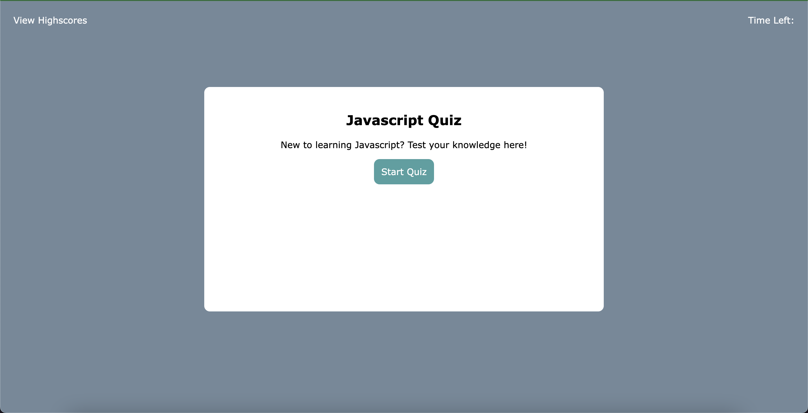
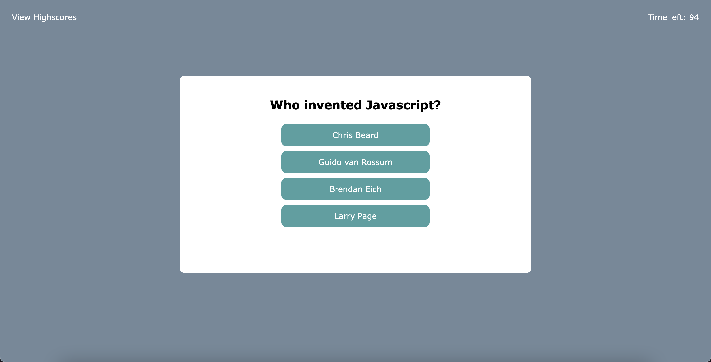
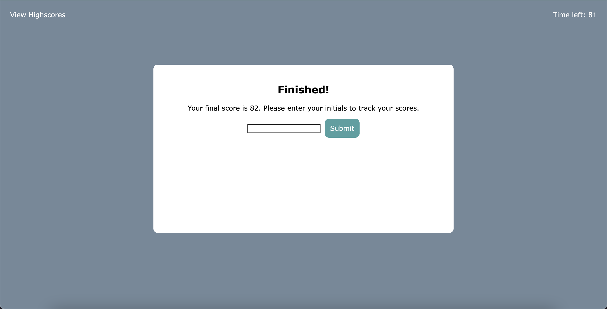
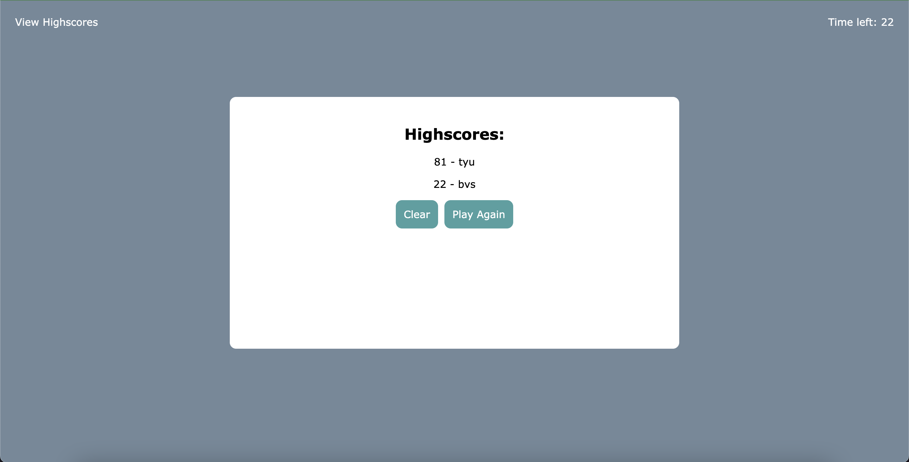

# Challenge 04: Javascript Fundamentals Quiz using Web APIs

For this week's challenge assignment, we had to create a javascript fundamentals quiz from scratch. I started with creating the HTML and styling the page with CSS. I then added in the Javascript one function at a time in the order it would appear. I took heavy inspiration of page functionality from the demo gif provided. Here was the User Story and Acceptance Criteria.

## User Story

```
AS A coding boot camp student
I WANT to take a timed quiz on JavaScript fundamentals that stores high scores
SO THAT I can gauge my progress compared to my peers
```

## Acceptance Criteria

```
GIVEN I am taking a code quiz
WHEN I click the start button
THEN a timer starts and I am presented with a question
WHEN I answer a question
THEN I am presented with another question
WHEN I answer a question incorrectly
THEN time is subtracted from the clock
WHEN all questions are answered or the timer reaches 0
THEN the game is over
WHEN the game is over
THEN I can save my initials and my score
```

## Screenshots of Page

Upon page arrival

Starting the quiz

Entering initials for highscore

All highscores


## Link of Deployed Page

https://ashpfander.github.io/javascript-fundamentals-quiz/